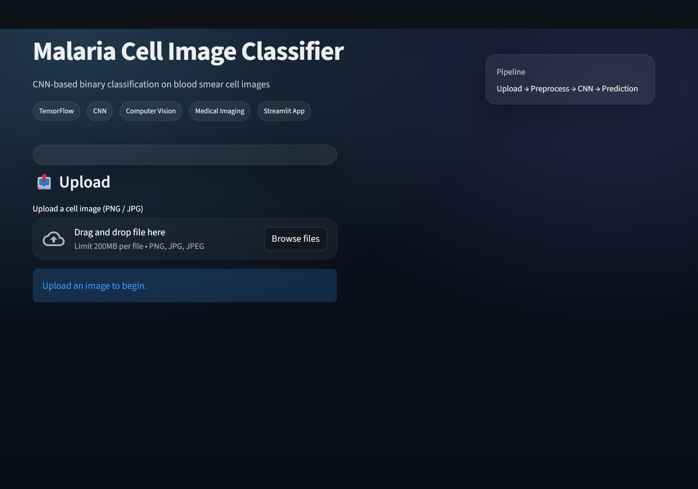
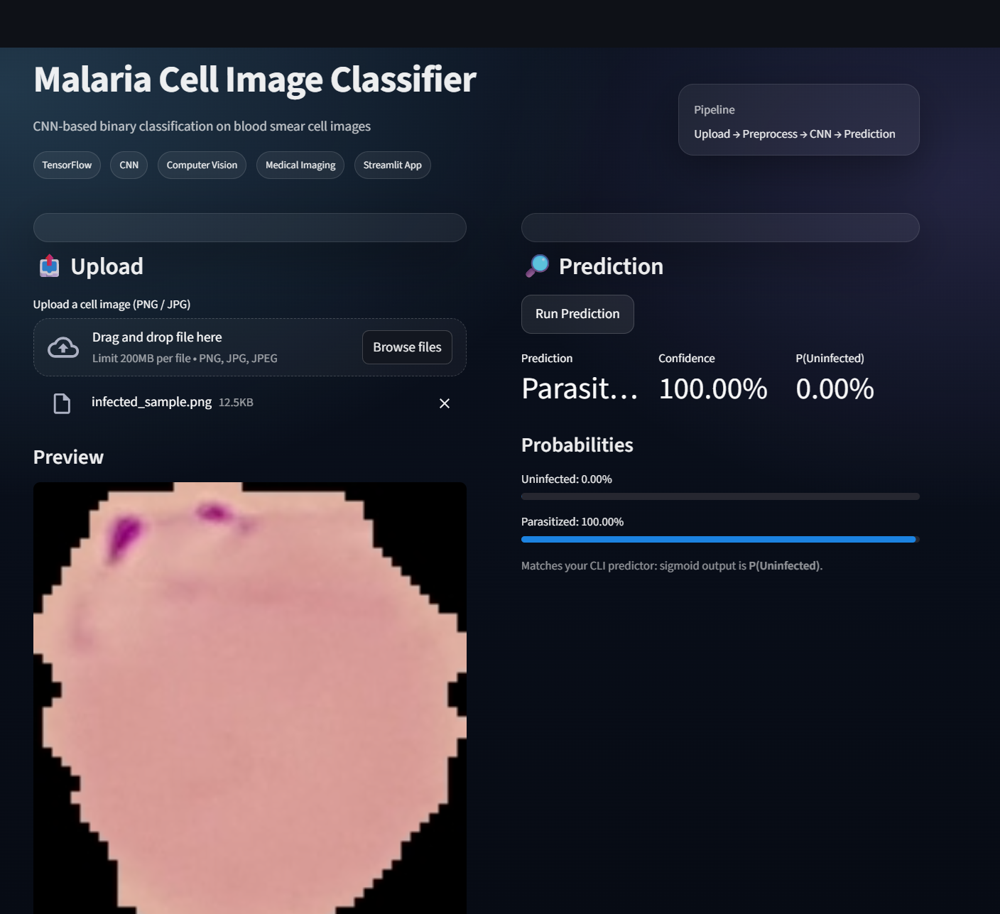
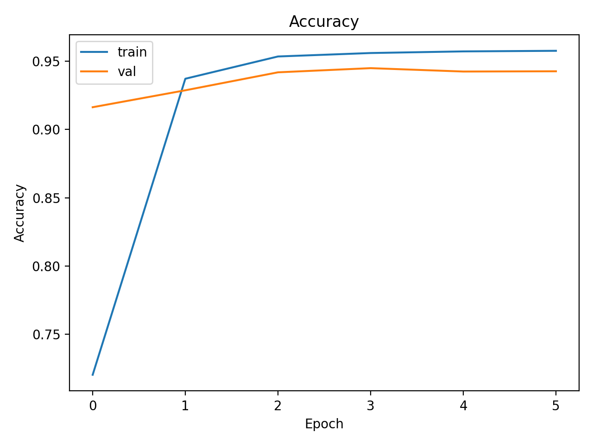
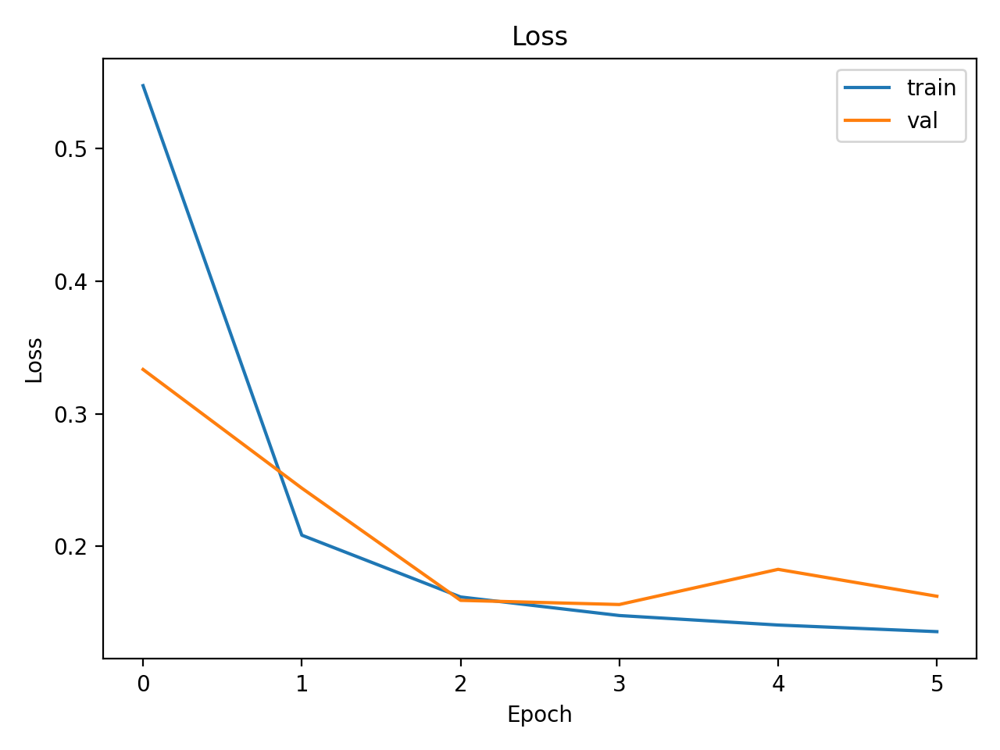
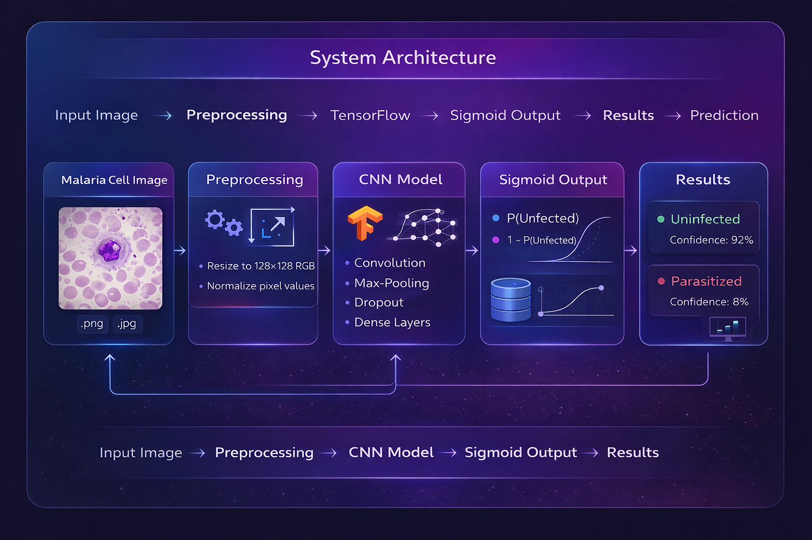

# 🧫 Malaria Cell Image Classification using CNN

A deep learning project that classifies malaria-infected and uninfected blood smear cell images using a **Convolutional Neural Network (CNN)** built with **TensorFlow**.

The project demonstrates a complete **end-to-end machine learning workflow**, including model training, command-line inference, and a **production-style Streamlit web application** for real-time image classification.

---

## 🔍 Project Overview

Malaria is a life-threatening disease caused by parasites transmitted through mosquito bites.  
Diagnosis commonly involves manual microscopic examination of blood smear images, which is:

- Time-consuming  
- Labor-intensive  
- Dependent on expert knowledge  

This project applies **computer vision and deep learning** to automate the classification of blood smear cell images into:

- **Uninfected**
- **Parasitized**

The goal is to showcase how CNNs can assist in **medical image analysis** and diagnostic support systems while maintaining clean engineering practices and reproducibility.

---

## 🧠 Model Summary

- **Architecture:** Convolutional Neural Network (CNN)  
- **Framework:** TensorFlow / Keras  
- **Input Size:** `128 × 128` RGB images  
- **Output:** Sigmoid probability → `P(Uninfected)`  
- **Loss Function:** Binary Cross-Entropy  
- **Task:** Binary image classification  

---

## 🗂️ Project Structure

```text
malaria-cell-image-classification/
│
├── app.py                  # Streamlit web application
├── requirements.txt        # Python dependencies
├── README.md
│
├── src/
│   ├── train.py            # Model training script
│   └── predict.py          # Command-line inference script
│
├── models/
│   └── malaria_cnn.keras   # Trained CNN model
│
├── results/
│   ├── accuracy_curve.png  # Training accuracy plot
│   └── loss_curve.png      # Training loss plot
│
├── assets/
│   └── images/
│       ├── webapp_ui.png
│       ├── webapp_result.png
│       └── system_architecture.png
│
└── .gitignore
```

---

## 🖥️ Web Application (Streamlit)

A Streamlit-based web application is included to demonstrate real-time inference using the trained CNN model.

### Application Features

- Upload blood smear cell images (.png, .jpg)
- Live image preview
- CNN-based prediction
- Confidence score
- Probability visualization for both classes

### 📸 Web App Preview

<p align="center">
  
</p>
<p align="center">
  
</p>

### Run the Web App Locally

```bash
python -m venv venv
venv\Scripts\activate
pip install -r requirements.txt
streamlit run app.py
```

---

## 🧪 Command-Line Inference

Predictions can also be performed directly from the command line.

```bash
python src/predict.py --image path/to/image.png
```

**Example output:**

```
Prediction: Uninfected (confidence: 0.94)
Raw sigmoid output (P(Uninfected)): 0.94
```

This script loads the trained model and performs inference on a single input image.

---

## 📊 Training Results

The model was trained on labeled blood smear cell images and evaluated using training and validation metrics.

### Accuracy Curve

<p align="center">
  
</p>

### Loss Curve

<p align="center">
  
</p>

These plots demonstrate stable convergence and effective learning behavior.

---

## 🧩 System Architecture

The overall system pipeline is illustrated below:

```
Input Image
     ↓
Preprocessing (Resize, Normalize)
     ↓
CNN Model (TensorFlow)
     ↓
Sigmoid Output (P(Uninfected))
     ↓
Final Prediction + Confidence
```

<p align="center">
  
</p>

---

## 🚀 Future Improvements

- Add Grad-CAM visualizations for model explainability  
- Improve generalization using data augmentation  
- Deploy the Streamlit app publicly  
- Extend to multi-class malaria species classification  
- Add evaluation metrics (Precision, Recall, F1-score)  

---

## 🧑‍💻 Author

**Pranjal Samant**  
Computer Engineering | AI & Embedded Systems
